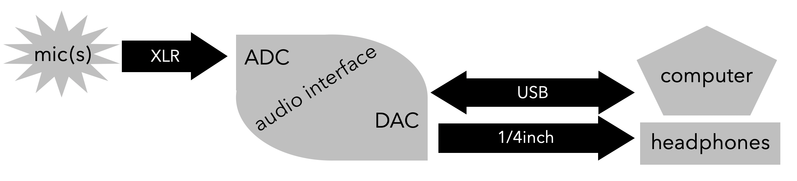

# Audio Recording

## **MULTITRACK RECORD** ⇨ **MIX** ⇨ **MASTER** ⇨ **DISTRIBUTE**

### **MULTITRACK RECORD**

Record at a quality as close to what you want for a final mix as possible \(spend time getting mic placement, room acoustics, preamp gains, etc. perfect!\). Don’t ever say you’ll wait to make something better at a later stage. You can only do so much with bad raw material. Use reference quality \(flat frequency response\) earphones and monitor speakers in your editing.

* [Here is a great video \(Links to an external site.\)](https://bit.ly/3d9Yl5g) about stereo microphone techniques ... allowing you to hear how they differ \(note, they accidentally \*showed\* the NOS when speaking about ORTF and vis versa in the very beginning of the video ... but I think when they perform, the label is correct\) - [here's another good video](https://www.youtube.com/watch?v=yhqzQpFwXg0)
* **Gain Staging**
  * have -6dB as the ceiling for recording \(peak below -6dB … not near 0dB\)
  * average the recording around -18dB
* **Mic Placement \(requires experimentation and adjustment\) and** [Microphone Polar Patterns](https://en.wikipedia.org/wiki/Microphone#Polar_patterns)
  * mono \(single\) mic individual instruments:
    * instruments need a certain distance from mic to create character and timbre
  * stereo \(two\) mic ensemble or solo performance = **experiment with different stereo mic techniques!**
    * closer for less of the room’s natural reverberation sound
    * further away for more of the room’s natural reverberation sound
    * the further your mic is away from your source, the more preamp gain you need, and thus you end up raising your noise floor
    * classical music stereo mic placement = 4-20 feet away and 7-10 feet above performers’ floor level


**Computer**

* lossless audio files \(WAV, AIFF, FLAC, CAF\) = highest quality
  * use through entire recording/editing process \(note different maximum size for each … and make sure your DAW is setup to record unlimited time\)
* lossy audio files \(MP3, AAC, OGG\) = these discard data in order to compress and save space
  * save as lossy ONLY when you are completely done with all editing and are ready to stream online \(in which case use CBR\) or to save space on a device \(in which case VBR is better\)
* sample rate = number of times per second that the signal voltage is measured
  * use 44.1kHz or 96kHz for recording audio alone
  * use 48kHz for recording audio to sync with video
* bit depth = use 24 bit = this is the resolution at which the amplitude of the signal voltage is measure
* bit rate = amount of data \(bits\) required to represent one second of audio \(higher bit rate = better quality\)
  * bit rate **=** bits per sample \(bit depth\) **x** samples per second \(sample rate\) **x** number of channels
  * bit rate of CD quality ==&gt;      1411.2kbps = 44,100 x 16 x 2          \(4min song would be 40MB\)
* good practices:
  * turn off all notifications and wifi, close any unnecessary programs, disable auto updates, use caffeine app
  * use a backup recorder: dedicated audio recorders like those made by Zoom or Sound Devices make great backup recorders \(format media cards in the device\)


### **MIX** \(VERTICAL\)

> Put all the tracks of a single song together \([plugin guide](https://blog.landr.com/audio-effects-plugins-guide/)\)

1. Amplitude
   * gain plugin should be the first plugin for every mix \(get each track down to around -18dB and make -6dB the ceiling\)
   * Volume and panning automation \(also envelops such as fade in, fade out\)
   * Dynamics Processing: Compressor \([video](https://www.youtube.com/watch?v=5pXbd1QcdcU), [article1](https://patches.zone/compression-guide), [article2](https://flypaper.soundfly.com/produce/compression-audio-basics/)\), Limiter, Expander \(ex. noise gate\), Normalize, Distortion, Envelop
2. Spectral Filter
   * Equalization \(high pass, low pass, low shelf, high shelf, peak filter, notch filter\)
3. Time = combine the original audio signal with delayed and modified copies of itself
   * Delay = [Reverb](https://flypaper.soundfly.com/produce/artificial-space-place-reverb-tech-primer/), Delay, Echo
   * Modulation effects: Chorus, Tremolo, Flanger and Phaser


**Destructive vs. Non-destructive editing:**

* Destructive = changing the actual audio file
  * Most processes performed in an “audio file editor” \(normalizing the audio file, for example\)
  * Time stretch & pitch shift \(but DAWs invisibly create new files so original audio files is not changed\)
* Non-destructive = just changing how the software reads the original audio file
  * Edits done to “regions” in the main timeline of the DAW \(Cut, copy/paste\)
  * Run audio through DSP \(plugins\)


### **MASTER** \(HORIZONTAL\)

> Fine tune each completed song to fit best with all other songs in an album; many times, those that master are only given stereo mix downs of tracks \(rather than multitrack DAW files or stems\)

1. Slight adjustments to EQ, stereo image, and reverb
2. dynamic processing to deliver to a service:
   * overall gain changes, compression, and limiting
3. Spacing and fades are added to the beginning and ending of each song
4. Make each song able to sound well played on any device

