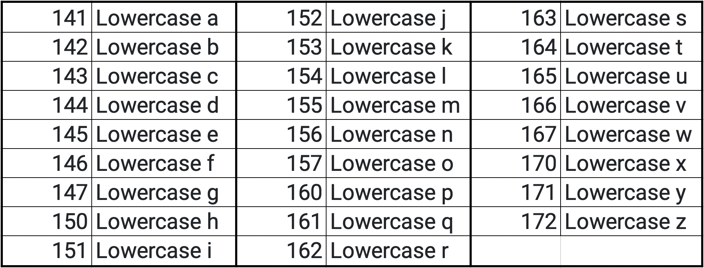

# MUS1331 Final Exam Questions

1. Define: literacy, digital literacy, and media literacy.

   **Computer Hardware:**

2. What makes a computer a computer?
3. List as many input and output devices as you can \(label them input or output\).
4. Define hardware and software.
5. Define data and give some examples.
6. Define binary \(use the following terms in your definition: machine language, high-level, low-level\).
7. List a few different mediums on which media and/or information has been stored in analog format.
8. List a few different mediums on which binary \(digital\) data has been stored.
9. During the exam your instructor will give you a word with all lowercase letter to convert to binary. The ASCII chart below lists decimal codes for each letter \(**\*not binary\***\); you will need to convert the decimal code to binary.

    

10. How many **\*bits\*** would it take to store your name in a plain text file?
11. What is a transistor, what did it replace, and why is it the most important invention of the 20th Century?
12. Define motherboard and explain its function.
13. Define CPU & GPU \(describe what each does\).
14. What is a multicore processor?
15. Define Hz, KHz, MHz, and GHz.
16. How many cycles \(steps of instructions\) per second can a quad core 2.4 GHz processor perform?
17. Define memory \(RAM\), explain its function, and discuss how it differs from storage.
18. What is the “Internet of Things” \(IoT\)?
19. What are microcontrollers & SoCs? ~~Provide an example real-life application for each.~~

    **Computer Software:**

20. Discuss the function and location of BIOS.
21. Define Operating System \(or System Software\) and list the three that are most common.
22. What is “the shell”? What is a program you can use to access “the shell”?
23. Define algorithm. Why do we use the word “algorithm” when we talk about programming languages?
24. Describe the difference between “open” and “proprietary” file formats and how that plays into “digital obsolescence”.

    **Computer Networks \(& Website Development\):**

25. In what type of format is everything encoded to transfer data between connections of the internet and what are the different types of mediums \(Ethernet cable is one, for example\) used to transfer that information?
26. How do bits physically travel down a copper wire? How do bits physically travel down a “glass wire”?
27. Define bandwidth. How is the size of bandwidth described?
28. Define packets \[of information\] - what is included in a packet?. Discuss the importance of TCP.
29. What are modems and routers?
30. Discuss the difference between IP and MAC addresses. \(include the term “DNS” in your answer\).
31. Describe the difference between HTML, CSS, and Javascript.
32. What is an Internet Service Provider \(ISP\)?

    \*\*\*\*

    **Physics of Sound:**

33. Define “psychoacoustics” and “acoustics.”
34. What does “sound propagation” mean?
35. Describe all that is illustrated in a time-domain representation of a sound wave form \(this will include describing the parts of a sound wave\) - use the terms “compression,” “rarefaction,” and “zero crossing” in a way that proves you understand them.
36. Define “transient.”
37. What unit is used to indicate a ratio of the following?:

    **what humans perceive as silence** to **how loud a sound seems to be to a human**

38. Provide a range of examples of things/environments that create different loudness levels \(from nearly silent all the way to the threshold of pain for humans\) … use the unit from the previous question.
39. What is the frequency range of human hearing?
40. What does the equal-loudness contour \(originally called the Fletcher—Munson curve\) refer to? What does this have to do with Pink Noise vs. White Noise?
41. Define wavelength, cycle, period, frequency, pitch, hertz \(Hz\).
42. What are the terms aperiodic and periodic used to describe in the sound medium?
43. Define complex tone \(or complex wave form\) by comparing it to a sine wave \(use the terms = timbre, harmonics, overtones, and partials\)
44. How is a spectrogram \(frequency domain\) different than a waveform \(time domain\)? Describe the sound spectrum of a clarinet \(hint: the harmonics produced by a clarinet are different from those produced by a saxophone or oboe\).
45. What is Fourier transform?
46. Describe how a sound is initially created by \*your\* instrument and all it goes through \(transductions\) for another person to perceive it in their brain \(that means you’ll have to also include how the ear works\).

    **Audio Synthesis:**

47. Describe the difference between a sampler and a synthesizer.
48. Oscillator = What is an oscillator? List a few basic waveforms created by different oscillators.
49. Amplitude = Explain what amplitude is.
50. Envelop = Explain what an amplitude envelop is \(using the term ADSR\).
51. Filter = What does a filter typically do to the audio signal? \(hint: what is filtered?\)
52. Modulation = Define modulation and give an example of how an LFO can be used in modulation \(hint = tremolo and vibrato\).
53. What is the difference between a polyphonic synth vs. a monophonic synth.
54. Why are General MIDI standards helpful?
55. What is a MIDI controller?
56. What is a MIDI sequencer?
57. Define virtual instrument.

    **Notation Software:**

58. What is an example of a “proprietary” music notation file format? What is an “open” music notation file format that can be exported/imported between different music notation software applications?
59. What type of graphic file do you export from notation software for use in word processor \(such as Microsoft Word\) or a graphics application \(such as Adobe Illustrator\) so that it prints crisply and sharply no matter how large the image is made?

    \*\*\*\*

    **Analog Sound Reinforcement:**

60. What is proper gain staging \(or proper gain structure\) for live sound? \(talk about the steps you would take to find the proper level for each part of the system — from mic to speaker\)
61. What does it mean to attenuate a signal? What word is used to describe the opposite of attenuating a signal?
62. Explain what a preamp does. What is the name of the knob used to control this?
63. Define clipping \(or distortion\). Create a drawing that illustrates how a signal is distorted by clipping.
64. Define pan.
65. Define EQ.
66. Describe what audio cable snakes are.
67. What does a microphone’s polar pattern tell you about how it functions? List a few polar patterns.
68. What is feedback and what are some ways to avoid/lesson it? 
69. What type of microphone is a Shure SM58? What is its polar pattern? Does it need phantom power \(48V\)?
70. What type of microphone is a Neumann U87? What size is it’s diaphragm? What polar patterns are available? Does it need phantom power \(48V\)?
71. How would you describe the sound difference between the Shure SM58 and the Neumann U87? \(use the term “transient response” in your answer\)

    \*\*\*\*

    **Digital Audio:**

72. Explain analog-to-digital conversion and digital-to-analog conversion using the terms sample rate and bit depth.
73. What are samples?
74. State the Nyquist Sample Theorem. What is the Nyquist frequency?
75. Define bit rate.
76. Describe quantization in regards to audio samples **\*and\*** MIDI data \(distinguishing the differences between the two\).
77. Write the following out with blanks filled in:
    * An analog signal is a \_\_\_\_\_\_\_\_\_ signal; analog signal values are known for \_\_\_\_\_\_\_\_\_\_\_\_\_\_\_\_\_.
    * A digital signal is a \_\_\_\_\_\_\_\_ signal; digital signals are only known at \_\_\_\_\_\_\_\_\_\_\_\_\_\_\_\_\_\_\_.
78. Discuss the difference between a MIDI file and a WAV file. What type of information is stored in each file?
79. Describe: mono, stereo, and surround sound files.
80. Define and discuss when you use lossless audio files \(and give examples of lossless file types\) and when you would use lossy audio files \(and give examples of lossy file types\).

    \*\*\*\*

    **Audio Recording/Mixing:**

81. How do the acoustics and noise present in the recording space effect mic placement when recording? \(For instance: Where would you place the mic if you didn’t like the space and didn’t want the characteristics of the space to be apparent in the recording?\)
82. Explain proper gain structure \(or staging\) in the recording process. What two levels are you looking for on the level meter when you are recording?  
83. Define multitrack recording.

    \*\*\*\*

    **Audio Editing:**

84. Explain proper gain staging in the mixing processes. What plugin should you add to every track in the very beginning of the mixing process \[in order to keep \*all\* faders initially at 0db … or -6dB if you choose that technique\]?
85. What is the purpose of automation in a DAW? Provide some examples of parameters you might automate.
86. Describe the differences between mixing and mastering.
87. How does normalization work?
88. How does a compressor work? \(be sure to include the terms “threshold” and “compression ratio”\).

    \*\*\*\*

    **Copyright and Licensing:**

89. Define copyright.
90. Describe Public Domain, ~~Fair Use, and Creative Commons.~~
91. Discuss the purpose of licenses.

    \*\*\*\*

    **Photography:**

92. What are the camera settings that give you control of exposure? What do each of them do?
93. Describe distance-of-field \(use the term “aperture”\).
94. How is a pixel in a digital photo just like an audio sample in a digital audio file?

    \*\*\*\*

    **Graphics:**

95. What is the difference between raster and vector?
96. Video monitors \(computer screens\) are dimensioned in \_\_\_\_\_\_\_\_\_\_\_ and printers print on paper that is dimensioned in \_\_\_\_\_\_\_\_\_\_\_. That is why the \_\_\_\_\_\_\_\_\_\_\_ specification of an image means nothing to a web browser displaying an image, but it determines the resolution and size that an image will print.

    \*\*\*\*

    **Video:**

97. Discuss the differences between frame rate and shutter speed. What is the industry standard film frame rate?
98. What is gain? What term is used for the same thing in photography?
99. Discuss why optical zoom is better than digital zoom.

    \*\*\*\*

    **Your Major:**

100. Identify and discuss technology uses that are unique to your field. Music educators: discuss ways technology greatly supports you in your teaching \(in and out of the classroom\). Music performance majors: speak to how you will use technology both on and off “the stage.” Music composition majors: focus on the use of technology for creating and for marketing your work. 

