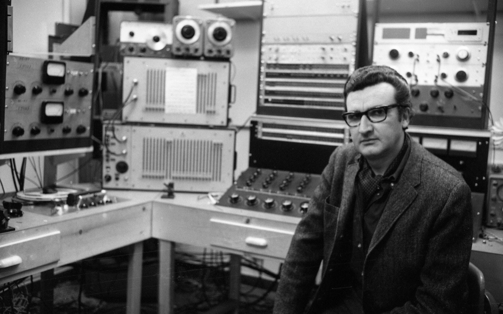

# Class01

## Analog

how film works = [https://www.youtube.com/watch?v=rqSbmw9u1CE&feature=youtu.be&t=127](https://www.youtube.com/watch?v=rqSbmw9u1CE&feature=youtu.be&t=127)

lossy example = [https://www.youtube.com/watch?v=icruGcSsPp0](https://www.youtube.com/watch?v=icruGcSsPp0)

how stereo records work = [https://www.vinylrecorder.com/stereo.html](https://www.vinylrecorder.com/stereo.html)

* Synchronism No. 6 = [https://www.youtube.com/watch?v=UNcVjQUZ5VI](https://www.youtube.com/watch?v=UNcVjQUZ5VI)

## Digital

* Tristan Perish _1-bit Symphony_ = [https://vimeo.com/12244413](https://vimeo.com/12244413)
* Andrew May _Ripped Up Maps =_ [http://andrewmaymusic.com/Works/Ripped-Up\_Maps.html](http://andrewmaymusic.com/Works/Ripped-Up_Maps.html)

a transition from a land to a pit or a pit to a land is interpreted as "1" while the absence of a transition is interpreted as "0"

[https://www.electronics-tutorials.ws/binary/signed-binary-numbers.html](https://www.electronics-tutorials.ws/binary/signed-binary-numbers.html)

