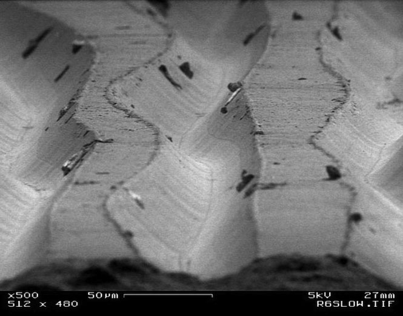

# Class01

lossy example = [https://www.youtube.com/watch?v=icruGcSsPp0](https://www.youtube.com/watch?v=icruGcSsPp0)

how stereo records work = [https://www.vinylrecorder.com/stereo.html](https://www.vinylrecorder.com/stereo.html)

a transition from a land to a pit or a pit to a land is interpreted as "1" while the absence of a transition is interpreted as "0"

[https://www.electronics-tutorials.ws/binary/signed-binary-numbers.html](https://www.electronics-tutorials.ws/binary/signed-binary-numbers.html)

