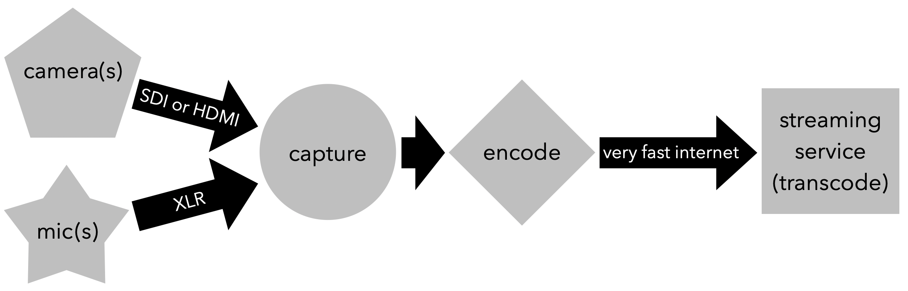

# Live Streaming Video \(+ Audio\)

* Get a license to broadcast!
* Get performers’ permission to stream their performance!
* Use professional lighting = the more light the better the video

#### **Suggested hardware/software:**

* \*\*\*\*[**Blackmagicdesign**](https://www.blackmagicdesign.com/) capture/encode/switch/broadcast hardware & software
* \*\*\*\*[**Open Broadcaster Software \(OBS\)**](https://obsproject.com/) for encoding, switching, and broadcasting

#### **Live streaming components:**

1. camera
   * output = SDI is best \(very long cable runs\), HDMI is good \(short cable runs only\)
   * zoom = high optical zoom \(do not use digital zoom\)
   * 4k will allow for cropping the picture without zooming/moving the camera
2. external mics = most camera mics are junk … use external mics!
3. capture = plug video \(SDI or HDMI\) and audio \(XLR\) into hardware that plugs into your computer if you are using a software encoder
   * some hardware capture cards also encode video
4. encode = convert raw, uncompressed video into a streamable compressed format
   * use recommended encoding settings, bitrates, and resolutions of the streaming service \[Youtube, Facebook, etc.\]\)
   * software encoders require **a lot** of computer processing power
5. video switcher = switch from multiple camera angles in real-time
6. broadcast = send to streaming service using an internet connection with 2 times as much upload speed as the highest bitrate you want to stream
7. streaming services transcode video into many different resolutions and bit rates so your audience can view it on any device \(desktop, tablet, and mobile\)

