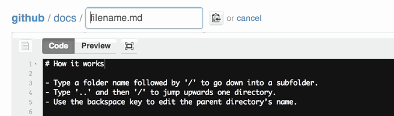

# Create a Website: GitHub Page

## **GitHub Pages**

1. go to [https://pages.github.com/](https://pages.github.com/) 
2. choose "Project site" and "Start from scratch" 
3. follow the instructions

    

4. upgrade the index.html file with a bit more detail

5. add audio

```text
<!DOCTYPE html>
<html>
  <body>
    <h1>My First Heading</h1>
    <p>My first paragraph.</p>
  </body>
</html>
```

## GitHub \(general\)

* git learning = [https://try.github.io/](https://try.github.io/) especially [https://learngitbranching.js.org/](https://learngitbranching.js.org/)
* github hello world = [https://guides.github.com/activities/hello-world/](https://guides.github.com/activities/hello-world/)
* [https://github.com/codepath/ios\_guides/wiki/Using-Git-with-Terminal](https://github.com/codepath/ios_guides/wiki/Using-Git-with-Terminal)\*\*\*\*
* \*\*\*\*[https://github.com/benjohansen/benjohansen.github.io/blob/master/index.html](https://github.com/benjohansen/benjohansen.github.io/blob/master/index.html)
* embed video = [https://github.com/etianen/html5media/wiki/embedding-video](https://github.com/etianen/html5media/wiki/embedding-video)



[https://stackoverflow.com/questions/18773598/creating-folders-inside-a-github-repository-without-using-git](https://stackoverflow.com/questions/18773598/creating-folders-inside-a-github-repository-without-using-git)

## HTML, CSS, and JavaScript

* understanding HTML, CSS, and JavaScript = [https://jsfiddle.net/isoundart/a7m9v1bz/](https://jsfiddle.net/isoundart/a7m9v1bz/)

