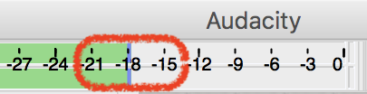
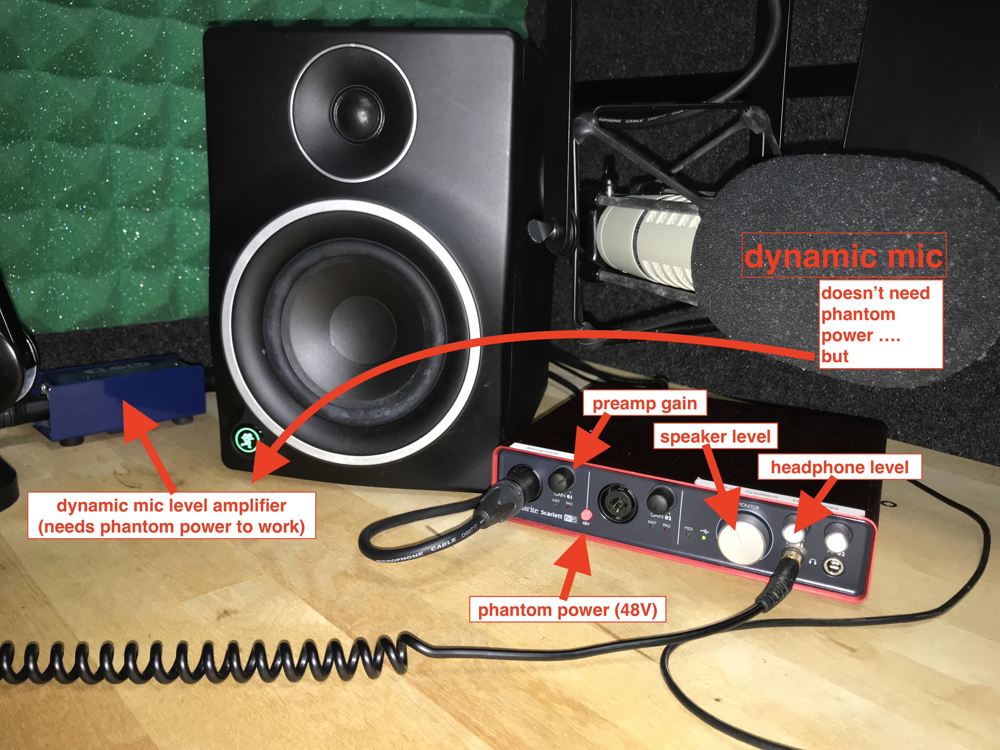

# Podcast Assignment

## Recording


[Reserve an Audio Booth](https://techpoint.libcal.com/spaces?lid=4700) in the Moody Media Lab


Record yourself speaking the content of your podcast using the provided broadcast dynamic mic \(plugged into the Cloud Lifter amplifier to provide it with more gain before it goes to the Focusrite's preamp\)

Use Audacity for recording.

Make sure you set the input device to the Focusrite Scarlett and the number of channels to 1 \(mono\)  

To have proper gain staging \([video](https://www.youtube.com/watch?time_continue=8&v=UvclmTMmGv0), [article](https://www.soundonsound.com/techniques/gain-staging-your-daw-software)\), set the gain on the Focusrite so your ceiling is -6dB \(peak below -6dB … not near 0dB\) and average the recording around -18dB.

Export as an uncompressed \(lossless\)  audio file \(WAV or AIFF\) to later edit in Logic Pro or Reaper

## Project Requirements

1. 3-5min in length
2. work on the project in Logic Pro or Reaper
3. discuss any topic of your choice
4. add at least one virtual instrument sound \(sound effect or musical … sampler or synthesizer\)
5. add at least one recording of yourself performing on your main instrument \(that may be voice or instrument\)
6. apply the proper loudness level conversion for streaming audio online
7. export as a compressed audio format \(AAC is better sounding compression than MP3\)


Aim for -16LUFS and -1TP to prepare your tracks for streaming services \(Youtube, Spotify, iTunes, etc.\)

Checkout the article on [Current Trends in Mastering](https://www.warpacademy.com/current-trends-in-mastering/) for more details.


