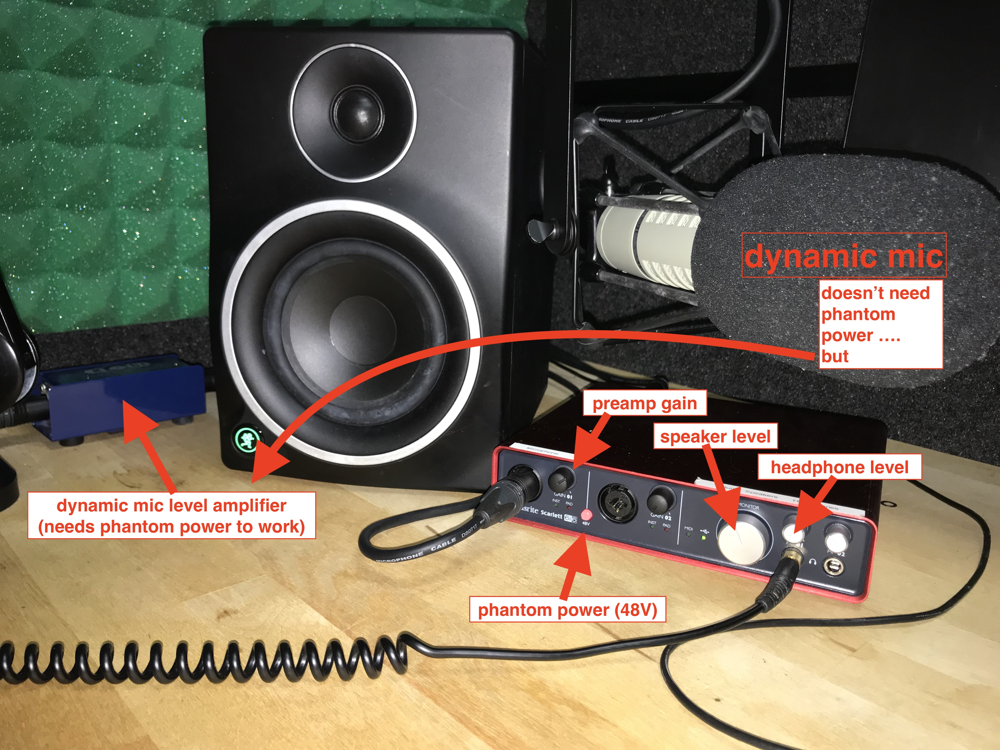

# Podcast Assignment

## Recording


[Reserve an Audio Booth](https://techpoint.libcal.com/spaces?lid=4700) in the Moody Media Lab


Record yourself speaking the content of your podcast using the provided broadcast dynamic mic \(plugged into the Cloud Lifter amplifier to provide it with more gain before it goes to the Focusrite's preamp\)

Use Audacity for recording.

Make sure you set the input device to the Focusrite Scarlett and the number of channels to 1 \(mono\)  

To have proper gain staging \([video](https://www.youtube.com/watch?time_continue=8&v=UvclmTMmGv0), [article](https://www.soundonsound.com/techniques/gain-staging-your-daw-software)\), set the gain on the Focusrite so your ceiling is -6dB \(peak below -6dB … not near 0dB\) and average the recording around -18dB.

Export as an uncompressed \(lossless\) audio file \(WAV or AIFF\) to later edit in Logic Pro or Reaper

## Project Requirements

1. 3-5min in length
2. work on the project in Logic Pro or Reaper
3. discuss any topic of your choice
4. add at least one virtual instrument sound \(sound effect or musical … sampler or synthesizer\)
5. add at least one recording of yourself performing on your main instrument \(that may be voice or instrument\)
6. apply the proper loudness level conversion for streaming audio online
   1. add a gain plugin
   2. add a True Peak meter
   3. add a Loudness meter
7. export as a compressed audio format \(AAC is better sounding compression than MP3\)


### Loudness

Aim for -16LUFS \(integrated\) and -1TP to prepare your tracks for streaming services \(Youtube, Spotify, iTunes, etc.\)

Checkout the article "[Current Trends in Mastering](https://www.warpacademy.com/current-trends-in-mastering/)" for more details.

> LUFS stands for Loudness Units Full Scale, and is a way of measuring the overall volume of a song in a way that’s much closer to the way the human ear detects volume changes.

> TP in this case stands for True Peak, and is used to measure the actual peak loudness of the file when played back in the analog realm \(ie, a speaker\).

Also checkout the article "[The End of Loudness War?](https://www.soundonsound.com/techniques/end-loudness-war)"

> Instead, loudness normalisation positively encourages the use of dynamics and transients. Tracks are made punchy by being dynamic rather than just loud, and compression and limiting become musical effects rather than essential competitive processing. Headroom is restored, inter-sample clipping is banished, and the digital environment finally achieves the sonic quality and dynamic range of which it is capable.


Finally, watch the following videos to understand Logic's loudness meters - [Part 1](https://youtu.be/A52ZNmk0S4g), [Part 2](https://youtu.be/lcTk6BK-fYc), [Part3](https://youtu.be/hGMLLalZPo0).

