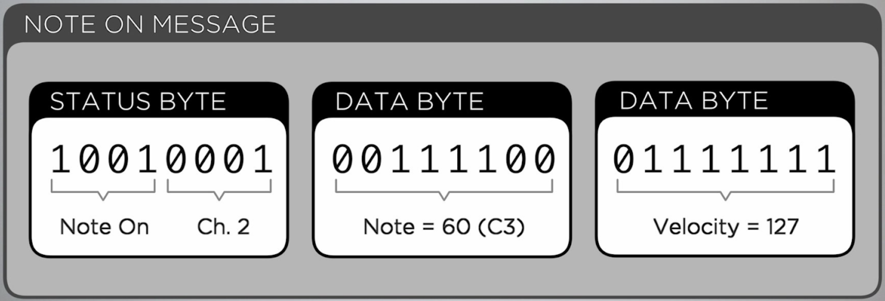
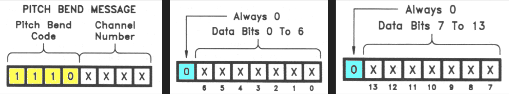
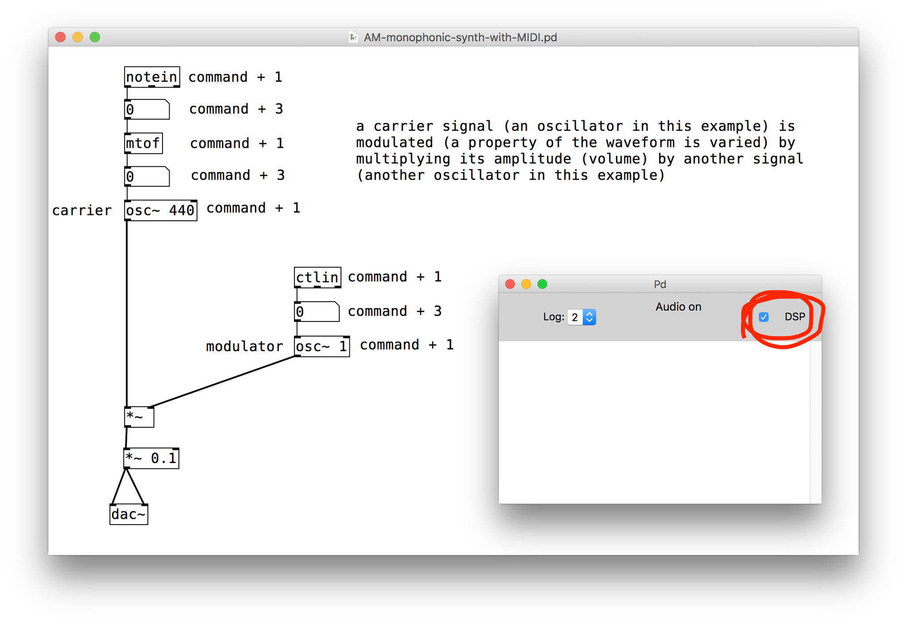
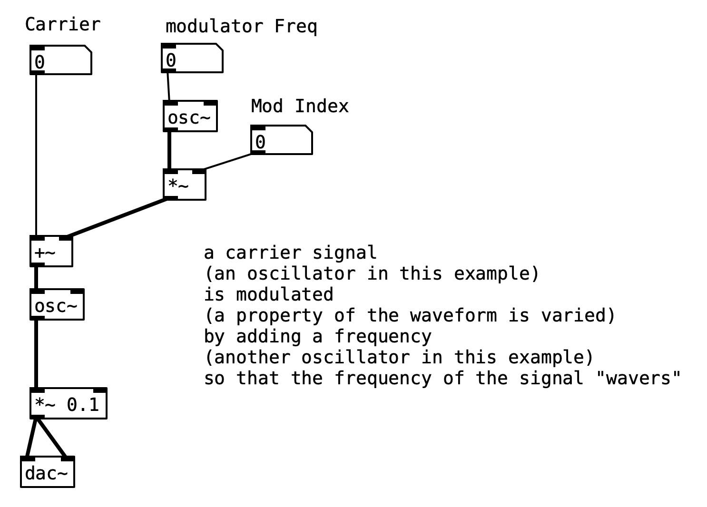

# MIDI Exercise


**Objective: discover how MIDI works**


1. make sure your MIDI keyboard is plugged in and on
   * Note: nothing in this exercise makes sound
2. open Pd.app \(search for it in spotlight or in the applications folder\)
   * click the "Yes" button when asked "Do you want Pd to create a documents directory ..."
3. from the "Media" menu at the top of the screen, choose "MIDI Settings..."
   * choose the MIDI keyboard hooked to your computer under "Input Devices"
   * you may have to click on "none" for the keyboard to be revealed
   * click the "Save All Settings" button
   * click the "OK" button
4. use the keyboard shortcut \[command+N\] to start a new patch
5. recreate the patch below

   * use \[command+1\] to add a new "Object"
     * type the object name
     * then click the mouse anywhere in the new patch except on the new "Object" in order to finalize the object creation
   * use \[command+3\] to add a number object
   * hover over outlet of an object, click and drag to draw patch cable to input of another object

   When you are done with creating the patch, discover all you can about MIDI protocol:

   * monitor the values displayed as you experiment with all parts of the MIDI keyboard controller \(keys, notebend, faders, knobs, etc.\)
   * be ready to discuss what you discovered

## wait to have a class discussion before moving on

## message format

## AM Synth \(Amplitude Modulation Synthesizer\)

recreate the patch below \(turn on digital signal processing \(DSP\) and play the MIDI keyboard / turn knobs\):



## FM \(Frequency Modulation\)


How can you control the FM patch below with MIDI?




