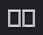

# Multicam Video Editing \(2+ Cameras\)


GarageBand only functions in 44.1kHz sample rate; audio for video is usually recorded at 48kHz.


## **DaVinci Resolve** \(free, BlackMagicDesign\)

tutorial = [https://youtu.be/S2yxFcm-te8?t=43s](https://youtu.be/S2yxFcm-te8?t=43s) 

sync audio = [https://www.youtube.com/watch?time\_continue=202&v=wUlxpk67Qaw](https://www.youtube.com/watch?time_continue=202&v=wUlxpk67Qaw)

demo files \(Baylor students only\) = [https://baylor.box.com/s/peq6pt10si0jj6zlh1im32y2mq95n2mk](https://baylor.box.com/s/peq6pt10si0jj6zlh1im32y2mq95n2mk)


Better performance while editing = Playback &gt; Proxy Mode &gt; Half \(or Quarter\) Resolution


1. choose the Media tab at bottom, then Import media
2. Select all media, right click, select “New Multicam Clip Using Selected Clips…” and do one of the following
   1. choose “Sound” as the Angle Sync
   2. _**if**_ syncing with "Sound" does not work: click on each file, view the waveform, and add a "Mark In" by pressing "i" to each clip at the clap board and sync using "Mark In"
3. right click the new multicam clip, select “New Timeline Using Selected Clips…” 
4. choose the Edit tab at bottom \(and make sure playhead is at the beginning\)
5. click on  in the top right corner to create two viewers \(monitors\)
6. change the left viewer \(monitor\) panel from Source  to Multicam  
7. choose  hold Option \(Mac\) or Alt \(PC\) and click the audio “angle” \(still has a red box\)
8. choose  hold Option \(Mac\) or Alt \(PC\) and click the first video angle \(the video angle will now have a blue box and the audio "angle" will have a green box\) 
9. to “direct” = press play and choose camera with the mouse or number keys \(don't ever choose the audio "angle" ... and note, you will leave  on\) ... you don't need to use the option key any more!
10. adjust when a camera change occurs: in Selection Mode  hover between two clips until you see the Roll Edit cursor  click and drag left or right
11. When you are done: Deliver tab at bottom \(use MPEG-4 as container, H.264 as compression\)


To expand multicam clip to edit cameras/audio individually \(to color grade or adjust sync\):

* right click on multicam clip in timeline, select “Open in Timeline”
* to exit expanded view: double click timeline name in bottom left \(e.g. Timeline &lt; Multicam\)


