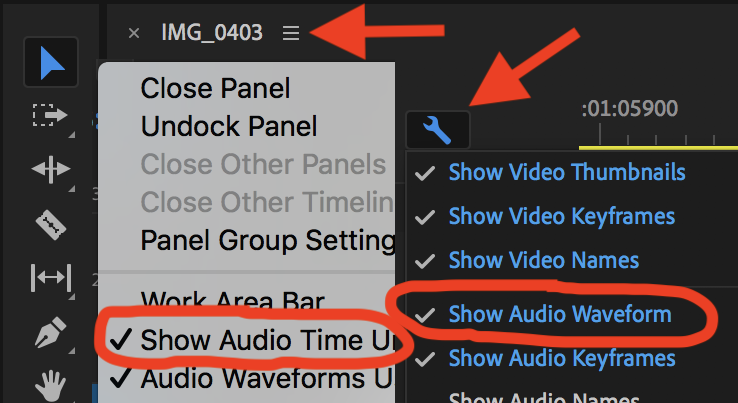

# Audition/Screening Video \(one camera\)

**General tips:**

* 👏 visually clap \(slate\) three times to assist in later synching audio and video
* use a tripod \(holding the camera with your hand is too shaky\)
* use only optical zoom \(don’t use digital zoom\)

**Camera settings:**

* use a separate audio recorder from the camera \(cameras have bad microphones\)
  * uncompressed \(AIFF, WAV\) 48kHz sample rate for audio
* [frame rate](https://www.diyphotography.net/learn-choose-best-frame-rate-videos-just-10-minutes/) = 24fps gives the “film” look; higher frame rates will look more like a news show 
* MP4 and MOV are easy to work with \(AVCHD can produce higher quality\)
* custom white balance or use a preset \(such as “tungsten”\)

## DaVinci Resolve Editing \(free from Blackmagicdesign\)


coming soon


## **Premiere Pro Editing** \($$ from Adobe\)

1. **choose the Assembly tab at the top of the screen**
2. drag the video and audio files into the project folder \(“Import media here to start”\)
   * if using AVCHD: you must right click and “import” using the Media Browser
3. double click the audio file; in the window that is showing the audio waveform
   * click the wrench and select “Show Audio Time Units” 
   * put playhead on first clap and press “m”
4. double click the video file; in the window that is displaying the video - click the waveform button to show the video’s audio waveform; put playhead on first clap and press “m”
5. **choose the Editing tab at the top of the screen**
6. drag the video file into the timeline on the bottom right 
7. drag the audio file below the video/audio
8. on the timeline \(bottom right\) = make sure “Show Audio Time Units” is checked under t the hamburger menu and “Show Audio Waveform” is checked under the wrench
9. select all the tracks in the timeline
10. right click on them and select “Synchronize”, select “clip marker”, and click OK
11. mute the camera audio track

#### **more editing**

* use the razor tool to cut clips, use the selection too \(arrow\) to select clips and delete them, lastly select all the clips and drag to very left to make it start at the right time
* **choose the Effects tab at the top of the screen**
  * choose Video Transitions &gt; Dissolve … drag “Dip to Black” over the end of the video clip to make it fade to black \(or the beginning to fade in from black\)
  * choose Audio Transitions &gt; Crossfade … drag one of the fades over the beginning and end of the audio track to fade in and fade out the audio

#### **When you are done:**

* File &gt; Export &gt; Media ...
* Format \(codec\) = H.264
* Container = MPEG-4

