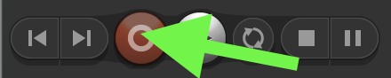

# Podcast Assignment

## Project Requirements

* 2-5min in length for the total podcast
* use Reaper for recording, mixing, and mastering \(and for adding the virtual instrument\)
* add all of the following to create a podcast \(check out [Radiolab](https://www.wnycstudios.org/podcasts/radiolab) if you are unsure how to incorporate sound effects and music\)
  * recording of you discussing a topic of your choice \(you may even interview someone\)
    * add proper EQ for your voice \(there are \*many\* articles online\)
    * add a [compressor](https://www.youtube.com/watch?v=5pXbd1QcdcU) \(there are \*many\* articles online\)
  * recording of the Helm virtual instrument which records MIDI data \(download and install before opening Reaper = [https://tytel.org/helm/](https://tytel.org/helm/) \)
    * View &gt; Virtual MIDI keyboard \(and note choices when you right click the virtual midi keyboard\)
    * keep synth around -18db too
  * at least five \*different\* samples \(sounds\) from freesound.org
    * you may get your material from a site other than freesound.org, but the material must be free to use without need to provide attribution
  * at least one musical recording you record yourself
* **all material must not be protected by copyright \(CC0 for freesound.org\)**

## Recording Your Voice

1. plug your interface into the computer and setup your interface with either the SM57 dynamic mic or Rode M5 with pop filter \(if using the Rode, turn on 48V phantom power\)
2. download and install Reaper = [http://reaper.fm/download.php](http://reaper.fm/download.php)
3. open Reaper
4. make sure your audio interface is selected in the device section of Reaper's preferences
5. add a new track
6. force the track to record in mono

    

7. record enable the track \(use headphones or make sure you turn off monitoring on the track\)
8. to have proper gain staging \([video](https://www.youtube.com/watch?time_continue=8&v=UvclmTMmGv0), [article](https://www.soundonsound.com/techniques/gain-staging-your-daw-software)\), set the \[preamp\] gain on your interface so your ceiling is -6dB \(peak below -6dB … not near 0dB\) and average the recording around -18dB.

   

9. press record

    


## Interviews

You can add two tracks and set one to record from your first mic input on your interface and the other track to record your second mic plugged into the second mic input of your interface.

To do this = simply **\*right\*** click on the record enable button \(red button\) on the track ... under  "Input: Mono" choose **Input 1** for one of the tracks then choose **Input 2** for the other track.   
You'll want to record enable both tracks before pressing record to start your interview \(make sure you set the gain of both inputs on the interface correctly before recording!\)


## Edit/Mix

* In Reaper:
  * place the playhead where you want to cut the audio region and press "s" to split

## We will do the following _during_ class together:

* **Apply the proper loudness level conversion** for streaming audio online
  1. Add the following Audio FX \(plugins\) to the "MASTER" track in the order given \(top down\):
     * gain plugin \(JS: Volume Adjustment\)
     * level and loudness meter
       * you'll have to download and install the Free Youlean Loudness Meter = [https://youlean.co/youlean-loudness-meter/](https://youlean.co/youlean-loudness-meter/)
  2. You'll need to play through your entire podcast watching the True Peak and LUFs meters
     * "Integrated" on the Loudness Meter should be less than -14dB \(raise or lower the JS: Voliume Adjustment plugin on the master track above the Youlean meter accordingly and analyze again\)
     * the level meter should never go above -1dB for True Peak \(raise or lower the JS: Volume Adjustment plugin on the master track above the Youlean meter accordingly and analyze again\)
* **Render** as the compressed \(lossy\) audio format MP3
  1. File &gt; Render &gt;
     * choose the "Output" \(where you want to save the file and what name it should have\)
     * Format: MP3
     * Mode: Max Bitrate/Quality
* **Now add your podcast to your Github site \*on a new page\***
  * you'll need to create a new page \(podcast.html\)
  * you'll need to add a link to the new page from your homepage [**using the href attribute**](https://www.w3schools.com/tags/att_a_href.asp)\*\*\*\*
  * you'll need to upload your mp3 to Github \(in the same folder as your index.html and podcast.html\)
  * you'll need to add the ****[**audio tag**](https://www.w3schools.com/tags/tag_audio.asp) ****to your podcast.html page

## Loudness


**Aim for -14LUFS \(integrated\) and -1TP** to prepare your tracks for streaming services \(Youtube = -13LUFS, Spotify = -14LUFS, iTunes = -16LUFS, etc.\)


"_Both of these songs have the same apparent loudness, but the second track has been turned down considerably to make this happen."_ \(pic above and quote from "[Current Trends in Mastering](https://www.warpacademy.com/current-trends-in-mastering/)"\)


### Loudness Resources

"[Current Trends in Mastering](https://www.warpacademy.com/current-trends-in-mastering/)"

> LUFS stands for Loudness Units Full Scale, and is a way of measuring the overall volume of a song in a way that’s much closer to the way the human ear detects volume changes.

> TP in this case stands for True Peak, and is used to measure the actual peak loudness of the file when played back in the analog realm \(ie, a speaker\).

"[The End of Loudness War?](https://www.soundonsound.com/techniques/end-loudness-war)"

> Instead, loudness normalisation positively encourages the use of dynamics and transients. Tracks are made punchy by being dynamic rather than just loud, and compression and limiting become musical effects rather than essential competitive processing. Headroom is restored, inter-sample clipping is banished, and the digital environment finally achieves the sonic quality and dynamic range of which it is capable.

"[What is LUFS, and Why Should I Care?](https://www.sweetwater.com/insync/what-is-lufs-and-why-should-i-care/)" \(Sweetwater article\)

> In theory, two pieces of music that register identical LUFS readings should sound like they’re at the same level, and in practice, they do indeed sound like they’re at the same level, regardless of whatever the peak or RMS readings say. So we have an immediate, practical benefit — if you’re mastering and want consistent levels among tracks, check their LUFS readings.


