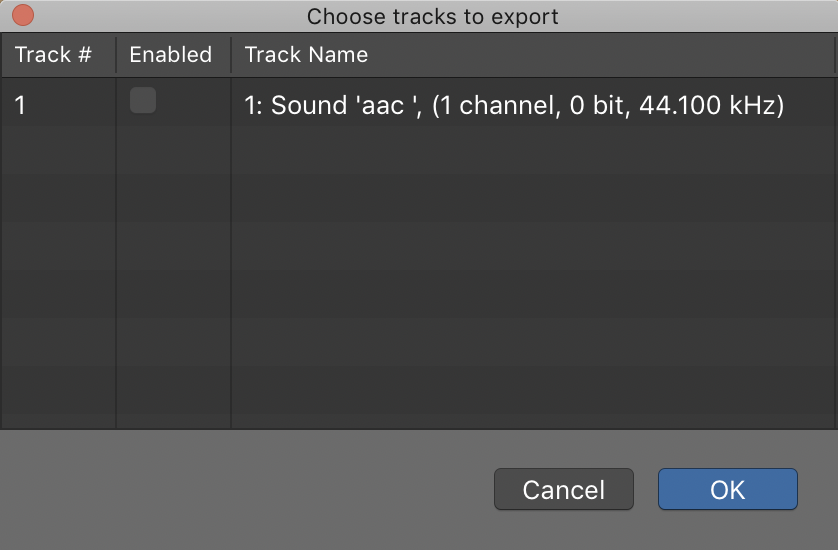

# Assignment \(analog audio\)

## Part 1

1. Complete [**Learning Synths \(Ableton interactive learning\)**](https://learningsynths.ableton.com/) ****and play a bit in the "playground"
2. Take a **1min** "[long shot](https://en.wikipedia.org/wiki/Long_take)" video recording of anything appropriate for a Baylor course \(you may use your phone\)
   * transfer the video to the computer and convert using QuickTime \(Mac\)
     * open in QuickTime
     * File &gt; Export As ... \(choose size of the original video and uncheck use HEVC; if you don't know what this is then go to Window &gt; Show Movie Inspector\)


To produce a video quickly that will allow for a wider range of musical possibilities, I suggest a fixed-camera rather than moving camera \(use a tripod or set your phone on something stationary\) ... need inspiration? = [https://www.pexels.com/videos/](https://www.pexels.com/videos/)


## Part 2

1. Change Logic Pro to function as Logic Pro \(rather than the default "GarageBand" mode\):
   * open Logic Pro
   * create empty project
   * choose Software Instrument
   * Go to Logic Pro X menu &gt; Preferences &gt; Advanced Tools
   * check Show Advanced Tools and click "Enable All" button at the bottom
   * close preferences
   * save your work \(as package on desktop\)
2. import the **1 min** video from Part 1 into Logic Pro \(depending on the original codec of your video, you _may_ need to convert using QuickTime before importing it into Logic\)
   * File &gt; Movie &gt; Open Movie ...
   * go ahead and leave a check next to "Open the Movie" and "Extract the Audio Track"
   * use the frame rate of the video
   * mute the audio track of the movie
3. create a soundtrack to the video using only synthesizers \(no virtual samplers\)
   * to find out more about each synthesizer within Logic Pro, within Logic Pro go to Help &gt; Logic Pro Instruments
   * **you must automate some parameters of the synthesizers**
   * **you must use at least 5 different synthesizers and have at least 10 tracks \(vertically\)**
4. save your work often!
   * put a check next to "Movie File" in the save dialogue to include your video file in the Logic file package
   * after completely quitting Logic, you'll need to right click on your Logic \[file\] package and compress it to a zip file in order to upload it to Box

## Part 3 \(during class\)


Make sure no region is selected \(if a region is selected, only that portion of the audio is exported to the video\)


1. export video + \[new\] music = **File &gt; Movie &gt; Export Audio to Movie ...**

   * choose a name for the video
   * choose an audio format \(AAC\), sample rate \(44.1k\), and bit rate \(256kbps\)
   * click "save"
   * uncheck the box under "Enabled" next the track on the following popup and click "Save" \(if you left a check in that box, it would export the original audio to the video as well\)

    

2. post to Youtube publicly \(if the video is private, it will not embed in your GitHub site\)
3. Embed the video in your GitHub site

   * click "share" under your video in Youtube and choose "embed"
   * copy the iframe code
   * paste in your index.html code \(putting it between HTML [div tags](https://www.w3schools.com/tags/tag_div.asp) will help separate it from the rest of the items on your site\) ... for example:

   ```text
   <div>
         <iframe width="560" height="315" src="https://www.youtube.com/embed/SI65D-E0kls" frameborder="0" allow="accelerometer; autoplay; encrypted-media; gyroscope; picture-in-picture" allowfullscreen></iframe>
   </div>
   ```

   [Here is an example of what a video and unordered list looks like](https://benjohansen.github.io/video/index.html) and [here is a link to the code](https://github.com/benjohansen/benjohansen.github.io/blob/master/video/index.html).

4. Below your video on your Github site:
   * Using the HTML unordered list tag, list the synthesizers you used along with the type of synthesizer they are \(for example: ES M = subtractive synthesis\)
5. **Add the URL to your Github Site to** [_**this Box Note**_](https://baylor.box.com/s/vw73z5p2288fj8x39of3oa6b1pxtksju)_**.**_

