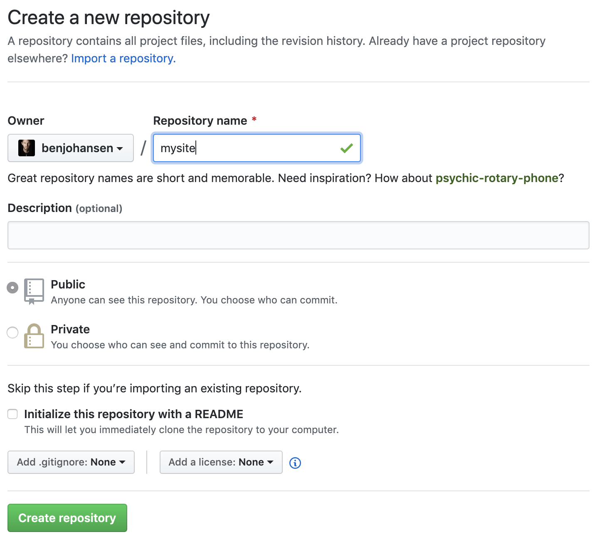
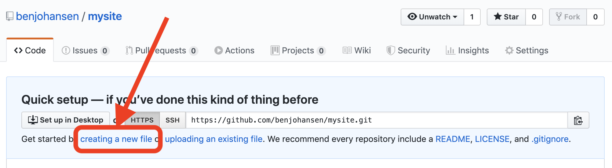
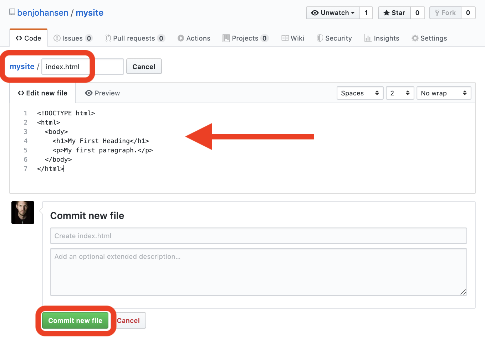
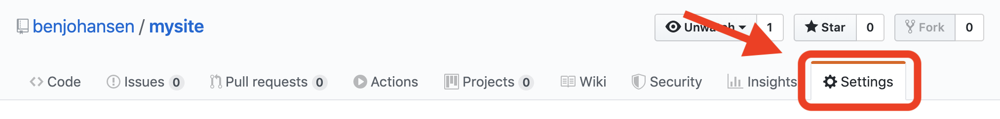
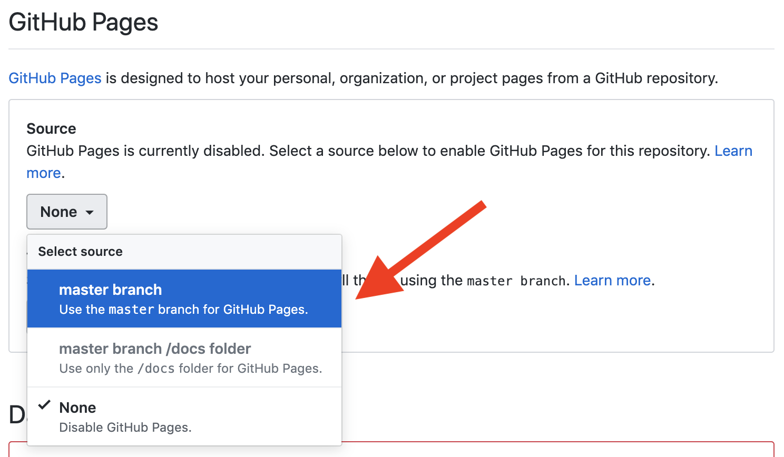
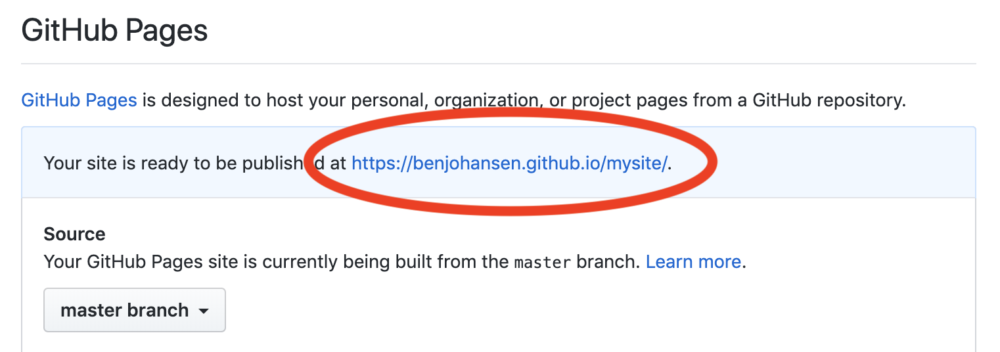

# Create a Website: GitHub Pages

## **GitHub Pages**


Screen shots below are difficult to see ... so press Command+ on a Mac \(Ctrl+ on PC\) as many times as you need to zoom in on this page.


1. create a GitHub account = [https://github.com/join](https://github.com/join)
2. create a new repository

    

   > \*\*\*\*
   >
   > **A "repository" is like a folder for your project.**
   >
   > \*\*\*\*

3. create a new file

    

4. name new file "index.html," add the code below, and "commit new file"

    

   ```text
   <!DOCTYPE html>
   <html>
     <body>
       <h1>My First Heading</h1>
       <p>My first paragraph.</p>
     </body>
   </html>
   ```

   > **a "commit" is like saving the changes to your files, but GitHub saves all of your commits so you can always go back to any "version" or "revision" of your files**
   >
   > \*\*\*\*

5. make site published using GitHub Pages
   * click on your repository "Settings" tab

      

   * change the "Source" to "master branch"

      

   * now your URL is displayed

      
6. upload mp3 to repository

    

7. click edit on your index.html file

    

8. insert the &lt;audio&gt; tag code to your index.html \(including &lt;div&gt; tags\) somewhere in the &lt;body&gt; of your page and commit changes \(Note: my mp3 file was named accordion.mp3 ... so edit the code to show your mp3 file's name\)

   ```
   <!DOCTYPE html>
   <html>
     <body>
       <h1>My First Heading</h1>
       <p>My first paragraph.</p>
    
       <div>
         <audio controls>
             <source src="accordion.mp3" type="audio/mpeg">
             Your browser does not support the audio tag.
         </audio>
       </div>
    
     </body>
   </html>
   ```

9. Add Scratch \(Free, browser-based visual programming language developed by the MIT Media Lab\)
   1. Create a Scratch user account = [https://scratch.mit.edu/join](https://scratch.mit.edu/join)
   2. Complete the following tutorial = [https://scratch.mit.edu/projects/editor/?tutorial=getStarted](https://scratch.mit.edu/projects/editor/?tutorial=getStarted)
   3. Complete another tutorial of your choice.
   4. Create something to embed \(it can be from the tutorial you did or something brand new\)
   5. Click "Share"
   6. click on "copy link" to bring up the embed code  
   7. add Scratch iframe to your index.html in GitHub and commit the changes

      ```
      <!DOCTYPE html>
      <html>
        <body>
          <h1>My First Heading</h1>
          <p>My first paragraph.</p>
    
          <div>
            <audio controls>
                <source src="accordion.mp3" type="audio/mpeg">
                Your browser does not support the audio tag.
            </audio>
          </div>
    
          <iframe src="https://scratch.mit.edu/projects/359828492/embed" allowtransparency="true" width="485" height="402" frameborder="0" scrolling="no" allowfullscreen></iframe>
    
        </body>
      </html>
      ```

## Add Styling \(we'll do this during our class meeting\)

1. create another new file in the same directory \(folder\) as your index.html file
2. name the file style.css
3. add the following code to the style.css file

   ```text
   h1 {
     font-size: 10em; /* 1em = 12pt = 16px */
     font-family: "Comic Sans MS", cursive, sans-serif;
     color: blue
   }

   p {
     font-family: Courier, Monaco, monospace;
     color: brown
   }
   ```

4. add a header in your index.html file so that it knows where to get the styling code

   ```text
   <!DOCTYPE html>
   <html>
  
     <head>
       <title>benjohansen</title>
       <meta charset="utf-8" />
       <link rel="stylesheet" href="style.css?version=2" />
     </head>

     <body>
       <h1>My First Heading</h1>
       <p>My first paragraph.</p>
    
       <div>
         <audio controls>
             <source src="accordion.mp3" type="audio/mpeg">
             Your browser does not support the audio tag.
         </audio>
       </div>
    
       <iframe src="https://scratch.mit.edu/projects/359828492/embed" allowtransparency="true" width="485" height="402" frameborder="0" scrolling="no" allowfullscreen></iframe>
    
     </body>
   </html>
   ```

