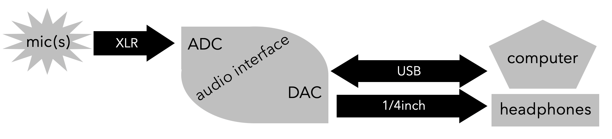

# Audio Recording

## **Mic Placement** \(requires experimentation and adjustment\)

* mono \(single\) mic individual instruments:
  * instruments need a certain distance from mic to create character and timbre
* stereo \(two\) mic ensemble or solo performance = **experiment with different stereo mic techniques!**
  * closer for less of the room’s natural reverberation sound
  * further away for more of the room’s natural reverberation sound
  * the further your mic is away from your source, the more preamp gain you need, and thus you end up raising your noise floor
  * classical music stereo mic placement = 4-20 feet away and 7-10 feet above performers’ floor level


[Microphone Polar Patterns](https://en.wikipedia.org/wiki/Microphone#Polar_patterns)


## **Audio Interface**

* sample rate = number of times per second that the signal voltage is measured
  * use 44.1kHz or 96kHz for recording audio alone
  * use 48kHz for recording audio to sync with video
* bit depth = use 24 bit = this is the resolution at which the amplitude of the signal voltage is measure

## **Gain Staging**

* have -6dB as the ceiling for recording \(peak below -6dB … not near 0dB\)
* average the recording around -18dB

## **Computer**

* lossless audio files \(WAV, AIFF, CAF\) = highest quality
  * use through entire recording/editing process \(note different maximum size for each … and make sure your DAW is setup to record unlimited time\)
* lossy audio files \(MP3, AAC, OGG\) = these discard data in order to compress and save space
  * save as lossy ONLY when you are completely done with all editing and are ready to stream online \(in which case use CBR\) or to save space on a device \(in which case VBR is better\)
* bit rate = amount of data \(bits\) required to represent one second of audio
  * bit rate **=** bits per sample \(bit depth\) **x** samples per second \(sample rate\) **x** number of channels
  * bit rate of CD quality ==&gt;      1411.2kbps = 44,100 x 16 x 2          \(4min song would be 40MB\)

### Computer Tips:

* turn off all notifications and wifi
* close any unnecessary programs
* disable auto updates
* use caffeine app
* use a backup recorder
  * dedicated audio recorders like those made by Zoom or Sound Devices make great backup recorders \(format media cards in the device\)

