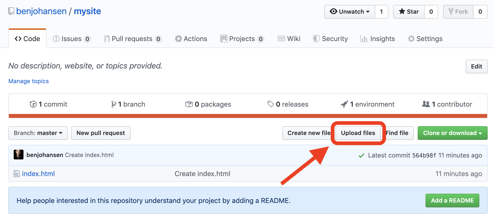

# Assignment \(networks\)

## 1. Watch the following videos:

* [How the Internet Works](https://www.youtube.com/playlist?list=PLzdnOPI1iJNfMRZm5DDxco3UdsFegvuB7) \(40min worth of videos\)

## 2. Create a Github "Webpage"


Screen shots below are difficult to see ... so press Command+ on a Mac \(Ctrl+ on PC\) as many times as you need to zoom in on this page.



* git learning = [https://try.github.io/](https://try.github.io/) especially [https://learngitbranching.js.org/](https://learngitbranching.js.org/)
* github hello world = [https://guides.github.com/activities/hello-world/](https://guides.github.com/activities/hello-world/)
* [https://github.com/codepath/ios\_guides/wiki/Using-Git-with-Terminal](https://github.com/codepath/ios_guides/wiki/Using-Git-with-Terminal)\*\*\*\*


1. create a GitHub account = [https://github.com/join](https://github.com/join)
2. create a new repository

    

   > \*\*\*\*
   >
   > **A "repository" is like a folder for your project.**
   >
   > \*\*\*\*

3. create a new file

    

4. name new file "index.html," add the code below, and "commit new file"

    

   ```text
   <!DOCTYPE html>
   <html>
     <body>
       <h1>My First Heading</h1>
       <p>My first paragraph.</p>
     </body>
   </html>
   ```

   > **a "commit" is like saving the changes to your files, but GitHub saves all of your commits so you can always go back to any "version" or "revision" of your files**
   >
   > \*\*\*\*

5. make site published using GitHub Pages
   * click on your repository "Settings" tab

      

   * change the "Source" to "master branch"

      

   * now your URL is displayed

      
6. upload an mp3 of one of the sounds you recorded for freesound.org to the repository

    

7. click edit on your index.html file

    

8. insert the &lt;audio&gt; tag code to your index.html \(including &lt;div&gt; tags\) somewhere in the &lt;body&gt; of your page and commit changes \(Note: my mp3 file was named accordion.mp3 ... so edit the code to show your mp3 file's name\)

   ```
   <!DOCTYPE html>
   <html>
     <body>
       <h1>My First Heading</h1>
       <p>My first paragraph.</p>
    
       <div>
         <audio controls>
             <source src="accordion.mp3" type="audio/mpeg">
             Your browser does not support the audio tag.
         </audio>
       </div>
    
     </body>
   </html>
   ```

