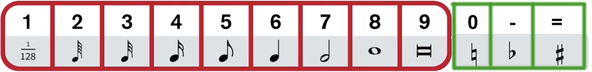

# Dorico Reference


**Dorico at a glance:**

* costs a lot of money
* ultra professional looking scores
* very intuitive
* [Design philosophy and higher-level concepts](https://steinberg.help/dorico_pro/v2/en/dorico/topics/program_concepts/program_concepts_design_philosophy_c.html)
* [Key musical concepts](https://steinberg.help/dorico_pro/v2/en/dorico/topics/program_concepts/program_concepts_key_musical_concepts_c.html)
* [**"How to" Videos on Youtube**](https://www.youtube.com/channel/UCIOwP19omIVDSUq2rTGgHKw/playlists?view=50&sort=dd&shelf_id=7)
* [Key Commands \(keyboard shortcuts\)](https://steinberg.help/dorico/v1/en/dorico/topics/introduction/introduction_dorico_key_commands_window_r.html)


## [Setup Mode](https://steinberg.help/dorico/v1/en/dorico/topics/setup_mode/setup_mode_introduction_c.html) \[ctrl/cmd + 1\]

* * Flows - remove instrument from a flow by deactivating \(uncheck\) the instrument under Players \(on left\)
  * Change how much will fit on a page \(make everything smaller or larger\):
    * * Setup &gt; Layout Options ... Space Size \(equivalent to the Finale % Tool\)

## [Write Mode](https://steinberg.help/dorico/v1/en/dorico/topics/first_steps/first_steps_your_first_notes_inputting_t.html) \[ctrl/cmd + 2\] = opposite of Finale

* Whenever you see the caret, you are inputting new music.
* When you do not see the caret, you are editing existing music.
* to leave note input \(caret\) press ESC
* [input rests](https://steinberg.help/dorico/v2/en/dorico/topics/write_mode/write_mode_rests_inputting_t.html) \[ space bar \] = press space bar instead of a pitch
  * OR press comma to toggle on/off rests .... choose a duration, then press a note on the MIDI keyboard or a letter \(A, B, C, D, E, F, G\) on the QWERTY keyboard to input a rest at the duration you chose
* insert mode \[ i \] = ALL notes downstream on staff move \(not just in one measure like Finale\)
  * if you select notes and change their duration, other notes will shift
* dynamics = select a group of notes and \[Shift + D\] ... add p&lt;f to the popover
  * \(if you move a note, the hairpin adjusts\)
* Shift + \[letter\] is used to create something
  * \[Shift + V\] = [add another voice \(or layer\)](https://www.youtube.com/watch?v=IKBU7z0gAVo&list=PLoyaeouPUsdsnltPMEyV6pzuHh6cs9-Cp&index=9) ... make sure the stem is pointing the direction you need
    * press \[ v \] to switch between layers you have created
    * to remove rests created by adding voices = use start and end voice from bottom menu \([see this video](https://www.youtube.com/watch?v=IKBU7z0gAVo&list=PLoyaeouPUsdsnltPMEyV6pzuHh6cs9-Cp&index=9)\)  OR select a rest you want to delete and go to Edit &gt; Remove Rests
  * \[Shift + M\] = add a meter starting at the selected note \( example = 4/4  ... or 4/4,1 if there is a pickup\)
  * \[Shift + K\] = add a key signature \( example = Eb \)
  * \[Shift + L\] = add lyrics \([video](https://www.youtube.com/watch?v=IfhDVl-vRRo&list=PLoyaeouPUsdsnltPMEyV6pzuHh6cs9-Cp&index=10)\)
  * see [Key Commands](https://steinberg.help/dorico/v1/en/dorico/topics/introduction/introduction_dorico_key_commands_window_r.html) for more
* delete extra measures:
  * Write &gt; Trim Flow
* [enharmonic respelling](https://steinberg.help/dorico/v1/en/dorico/topics/write_mode/write_mode_accidentals_respelling_t.html) = press \[ALT +\] or \[ALT - \]
* move a note by an octave division = press \[SHIFT ALT uparrow\]

## [Engrave Mode](https://steinberg.help/dorico/v1/en/dorico/topics/engrave_mode/engrave_mode_introduction_c.html) \[ctrl/cmd + 3\] = point and click to adjust items \( [video](https://www.youtube.com/watch?v=-BYsKNIhP9A&list=PLoyaeouPUsdvy438lfsc78RZxhKTdOcKN) \)

* turn on frame editing \(top left switch\) \( [video](https://www.youtube.com/watch?v=0HbY8nZzrOw&list=PLoyaeouPUsdvy438lfsc78RZxhKTdOcKN&index=3) \)
  * green frame = text
  * blue frame = music \(chain frame\)
  * purple frame = graphics

## [Play Mode](https://steinberg.help/dorico/v1/en/dorico/topics/play_mode/play_mode_introduction_c.html) \[ctrl/cmd + 4\]

## [Print Mode](https://steinberg.help/dorico/v1/en/dorico/topics/print_mode/print_mode_introduction_c.html) \[ctrl/cmd + 5\]

* [export graphics](https://steinberg.help/dorico_pro/v2/en/dorico/topics/print_mode/print_mode_layouts_exporting_as_graphics_files_t.html?) \(to use in Microsoft Word for example\) 
  * Microsoft Word = export out of Dorico as PDF and crop in Preview … then:
    * open Microsoft Word
    * drag in the .PDF file
  * Adobe Illustrator \(export out of Dorico as SVG\)
    1. open the .SVG file in Illustrator
    2. everything will be editable, but it will all be grouped together
    3. with everything selected, go to Object &gt; Ungroup
    4. now there are many groups of grouped objects … so you’ll still need to go to Object &gt; Ungroup for staff lines and groups of notes 
    5. now you should be able to edit items individually
    6. to crop:
       * choose the Artboard Tool
       * crop area
       * File &gt; Export &gt; Export As …
       * put a check in the box “Use Artboards”

