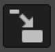

# Assignment \(photography\)

### Some great things Adobe Photoshop can do:

* [https://helpx.adobe.com/photoshop/how-to/photo-retouching-basics.html](https://helpx.adobe.com/photoshop/how-to/photo-retouching-basics.html)
* [https://helpx.adobe.com/photoshop/how-to/image-resizing-basics.html](https://helpx.adobe.com/photoshop/how-to/image-resizing-basics.html)
* [https://helpx.adobe.com/photoshop/how-to/ps-layers-basics.html](https://helpx.adobe.com/photoshop/how-to/ps-layers-basics.html)

1. **Use Gimp**, an open source \(free\) alternative to Photoshop. It is honestly not as good as Photoshop because it is a bit more difficult to use and they didn't have all the money Adobe has to improve it through research and development ... but it is the best free option!
   * Download and install [Gimp](https://www.gimp.org/)
   * Layers in Gimp = [https://bit.ly/2U9IFYH](https://bit.ly/2U9IFYH)
     * two very useful tools \(make sure you select the layer you want to work with first\):
       *  scale tool \(click "Readjust" in the popup if the resize boxes are off the screen\)
       *  move tool
   * Working with layers is a very practical skill to develop. Use your phone camera \(or better camera if you have one\) to take at least 3 different photos of something \(big picture photo and detail photos\). Then create a collage-like document similar to what you did in the tutorial, but with your own photos. Go to File &gt; Export As ... and save as a JPEG \(by choosing the format in the bottom left "Select File Type"\). Finally, add the image to a new page on your Github website.

